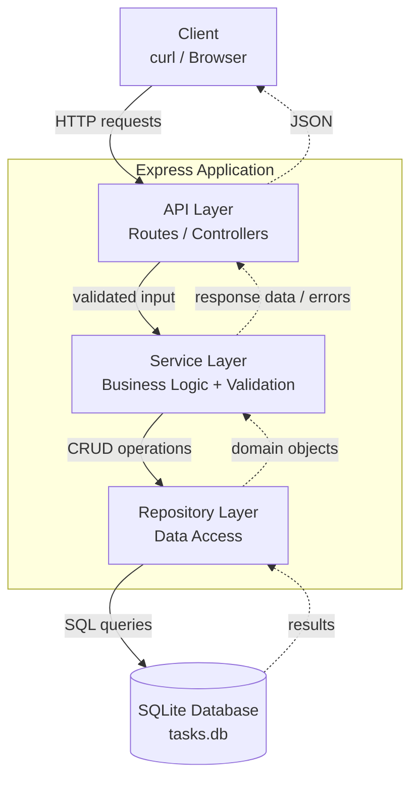
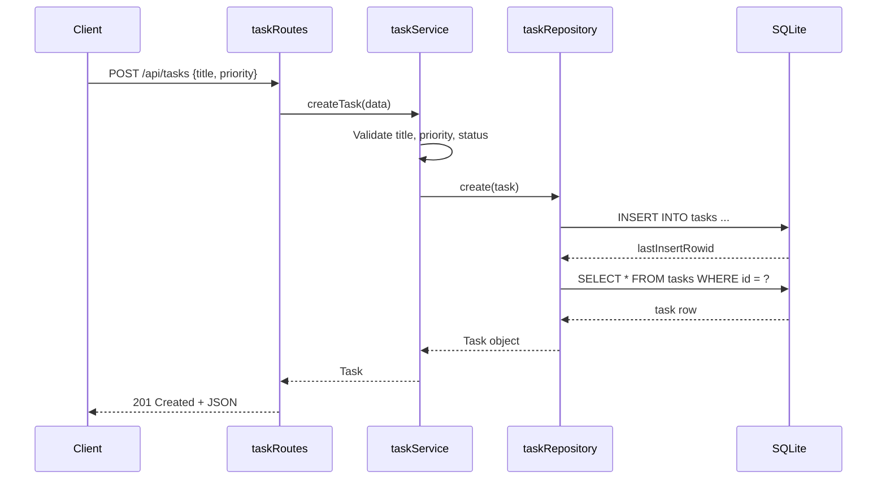
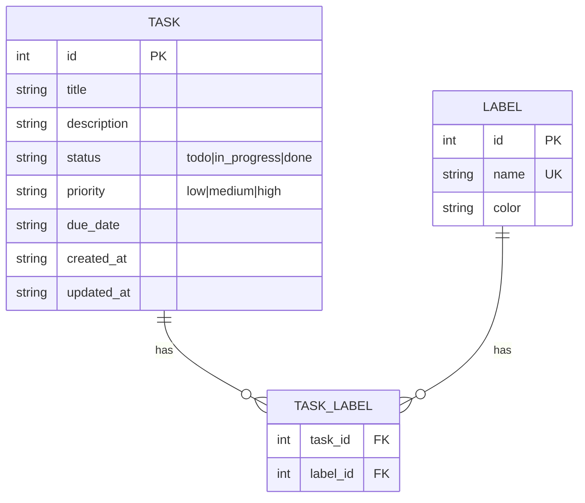

# Architecture — Personal Task Tracker

## High-Level Diagram



## Layer Responsibilities

| Layer | Responsibility | Files |
|---|---|---|
| API | HTTP handling, request validation, response formatting | `src/api/taskRoutes.js`, `src/api/labelRoutes.js` |
| Service | Business logic, validation rules, error types | `src/services/taskService.js`, `src/services/labelService.js` |
| Repository | Database access, SQL queries | `src/repositories/taskRepository.js`, `src/repositories/labelRepository.js` |
| Database | Schema, persistence | `src/db/database.js`, `tasks.db` |
| Utils | Date helpers, common utilities | `src/utils/dateHelper.js` |

## Key Design Decisions

1. **Repository pattern** — separates SQL from business logic. Makes service layer testable with mocked repository.
2. **Typed errors** (`ValidationError`, `NotFoundError`) — let API layer map errors to HTTP codes consistently.
3. **No business logic in routes** — routes only handle HTTP concerns; logic lives in services.
4. **Parameterized queries** — all SQL uses `?` placeholders to prevent SQL injection.
5. **Sort whitelist** — even though `ORDER BY` is dynamic, allowed columns are whitelisted to prevent injection.

## Data Flow Example: Create Task



## Data Model



## API Endpoint Map

| Method | Path | Feature | Description |
|---|---|---|---|
| GET | /health | - | Health check |
| POST | /api/tasks | F1 | Create task |
| GET | /api/tasks | F1, F2 | List with optional filters |
| GET | /api/tasks/:id | F1 | Get one task |
| PUT | /api/tasks/:id | F1 | Update task |
| DELETE | /api/tasks/:id | F1 | Delete task |
| GET | /api/tasks/views/overdue | F4 | Overdue tasks |
| GET | /api/tasks/views/today | F4 | Today's tasks |
| GET | /api/tasks/views/this-week | F4 | This week's tasks |
| POST | /api/labels | F3 | Create label |
| GET | /api/labels | F3 | List labels |
| GET | /api/labels/:id | F3 | Get one label |
| DELETE | /api/labels/:id | F3 | Delete label |
| POST | /api/labels/tasks/:taskId/labels/:labelId | F3 | Attach label to task |
| DELETE | /api/labels/tasks/:taskId/labels/:labelId | F3 | Detach label |
| GET | /api/labels/tasks/:taskId/labels | F3 | Get task's labels |

## Error Handling Strategy

```
Service throws → Route catches → Maps to HTTP status

ValidationError  →  400 Bad Request
NotFoundError    →  404 Not Found
(other Error)    →  500 Internal Server Error
```

Each route uses try/catch and checks error type with `instanceof`.